# Sơ Đồ Nối Dây Hệ Thống

> File này trước đó bị thiếu phần đầu của sơ đồ (thiếu khai báo `flowchart`,
> thiếu các subgraph Nguồn/Arduino/L298N/Servo và thiếu định nghĩa nhiều node
> như `PSU_5V`, `D22`, `D24`...) nên không render được. Đã bổ sung đầy đủ bên dưới.

```mermaid
flowchart TD
    %% ================== NGUỒN ĐIỆN ==================
    subgraph Power [Nguồn điện - PSU]
        direction TB
        PSU_5V[Nguồn tổ ong 5V - cấp Servo và cảm biến]
        PSU_12V[Nguồn tổ ong 12V - cấp động cơ băng tải]
        PSU_GND[GND chung của 2 nguồn tổ ong]
    end
    %% ================== ARDUINO ==================
    subgraph ArduinoBoard [Arduino Mega 2560]
        direction TB
        GND_A[Chân GND]
        PIN_5V[Chân 5V]
        D2[D2]
        D3[D3]
        D5[D5]
        D6[D6]
        D9[D9]
        D22[D22]
        D23[D23]
        D24[D24]
        D25[D25]
    end
    %% ================== L298N ==================
    subgraph L298N [Mạch cầu H L298N - Băng tải]
        direction TB
        ENA[ENA - Điều tốc]
        IN1[IN1 - Chiều quay]
        IN2[IN2 - Chiều quay]
        OUT1[OUT1]
        OUT2[OUT2]
        VMS[VMS - Nguồn động cơ]
        GND_L[GND L298N]
    end
    Motor[Động cơ DC Băng tải]
    %% ================== SERVO ==================
    subgraph Servos [4 Servo Tay Robot]
        direction TB
        S_Base[Dây Tín hiệu Đế]
        S_Shoulder[Dây Tín hiệu Vai]
        S_Elbow[Dây Tín hiệu Khuỷu]
        S_Gripper[Dây Tín hiệu Kẹp gắp]
        S_VCC[TẤT CẢ Dây Đỏ VCC 5V]
        S_GND[TẤT CẢ Dây Nâu Mass]
    end
    %% Cảm biến
    subgraph Sensors [2 Cảm biến Quang E18]
        direction TB
        IR_S_OUT[Cảm biến ĐẦU - Dây Đen Tín Hiệu]
        IR_E_OUT[Cảm biến CUỐI - Dây Đen Tín Hiệu]
        IR_VCC[Cả 2 Dây Nâu 5V]
        IR_GND[Cả 2 Dây Xanh GND]
    end
    %% Nối Nguồn & Mass
    PSU_GND <==>|BẮT BUỘC NỐI CHUNG| GND_A
    PSU_GND ==> S_GND
    PSU_GND ==> GND_L
    PSU_GND ==> IR_GND

    PSU_5V == Cấp dòng lớn ==> S_VCC
    PSU_12V ==> VMS

    PIN_5V -. Nuôi cảm biến .-> IR_VCC
    %% Băng tải
    D2 -->|Điều tốc| ENA
    D22 -->|Chiều quay| IN1
    D23 -->|Chiều quay| IN2
    OUT1 --> Motor
    OUT2 --> Motor
    %% Servo Robot
    D3 --> S_Base
    D5 --> S_Shoulder
    D6 --> S_Elbow
    D9 --> S_Gripper
    %% Cảm biến
    IR_S_OUT -->|Bật băng tải| D25
    IR_E_OUT -->|Dừng băng tải| D24
```

### Chú thích màu dây thực tế:
*   **Servo:** Dây Đỏ = VCC 5V, Dây Nâu = GND, Dây Cam/Vàng = Tín hiệu cắm vào Arduino.
*   **Cảm biến quang E18 (loại thân vàng):** Dây Nâu = Nguồn 5V, Dây Xanh dương = GND, Dây Đen = Tín hiệu OUT.
*   **Lưu ý an toàn:** GND của nguồn tổ ong 5V/12V, GND của Arduino và GND của L298N/cảm biến **bắt buộc phải nối chung** với nhau, nếu không tín hiệu điều khiển sẽ bị sai/nhiễu.
*   Có **2 cảm biến** (không phải 1): cảm biến ĐẦU băng tải (chân D25) để tự động bật băng tải khi có vật đặt vào, cảm biến CUỐI băng tải - đúng vị trí gắp (chân D24) để tự động dừng băng tải cho tay robot gắp. Khớp với `PIN_SENSOR`/`PIN_START_SENSOR` trong `arduino_arm_sorter.ino`.

## ⚡ AN TOÀN ĐIỆN — CÁC ĐIỂM DỄ GÂY CHẬP MẠCH / CHÁY NỔ

Đọc kỹ phần này **trước khi cấp nguồn lần đầu**, đây là các lỗi thường gặp nhất
khi làm đồ án dạng nhiều nguồn (multi-supply) như thế này:

1. **GND thì nối chung, nhưng dây (+) thì TUYỆT ĐỐI KHÔNG được nối chung.**
   PSU_5V(+), PSU_12V(+) và chân 5V của Arduino là 3 đường điện áp khác nhau,
   không được chạm/nối trực tiếp vào nhau ở bất kỳ điểm nào (kể cả qua domino
   hay board đồng) — chỉ có dây GND (-) mới được gom chung một điểm. Nối lộn
   2 đường (+) vào nhau là nguyên nhân chập mạch phổ biến nhất.
2. **Arduino Mega phải có nguồn RIÊNG**, KHÔNG lấy điện trực tiếp từ PSU_5V
   (nguồn servo). Cấp cho Arduino qua cổng USB (từ máy tính) hoặc qua giắc
   DC 7-12V ở cổng nguồn riêng của Arduino. Sơ đồ trên chỉ dùng chân 5V của
   Arduino để nuôi 2 cảm biến (dòng rất nhỏ, vài chục mA, an toàn), KHÔNG dùng
   chân 5V này để cấp cho 4 servo.
3. **Module L298N thường có 1 jumper "5V-EN"** (bật bộ ổn áp 78M05 trên board
   để tự tạo ra 5V từ nguồn 12V). Vì mạch này đã có nguồn 5V riêng cho servo
   rồi, **hãy để hở/không nối chân "5V ra" của L298N vào bất kỳ đâu khác**
   (đừng nối nó với PSU_5V hoặc chân 5V Arduino) để tránh 2 nguồn 5V "đánh
   nhau" (fighting) gây nóng, hỏng linh kiện.
4. **Nên lắp cầu chì (fuse)** trên từng đường nguồn ngay sau nguồn tổ ong:
   ví dụ ~5A trên đường 5V (servo) và ~3A trên đường 12V (băng tải), để nếu
   lỡ chập dây thì cầu chì đứt trước khi dây nóng chảy/cháy.
5. **Dòng khởi động (stall current) của servo MG996R có thể lên tới ~2.5A/con
   khi bị kẹt/quá tải** (lúc chạy bình thường chỉ ~0.5-0.9A). Với 4 servo cùng
   lúc, dòng đỉnh lý thuyết có thể tới ~10A dù hiếm khi xảy ra cùng lúc thật
   sự. Nguồn tổ ong 5V 4A ở mức tối thiểu — nếu tay robot rung/yếu điện khi
   nhiều servo chạy cùng lúc, nên nâng lên nguồn 5V 6-10A, dùng dây nguồn to
   bản (không dùng dây tín hiệu mảnh để đi dây nguồn) và có thể gắn thêm 1 tụ
   hóa lớn (1000-2200µF) gần chỗ đấu chung VCC của 4 servo để giảm sụt áp tức
   thời.
6. **Bọc cách điện mọi mối hàn/domino** bằng ống co nhiệt hoặc băng keo điện,
   đặc biệt các điểm nối gần khung nhôm định hình (khung nhôm dẫn điện — nếu
   dây hở chạm vào khung sẽ chập hoặc rò điện ra khung).
7. **Kiểm tra bằng đồng hồ VOM (đo thông mạch/điện trở) TRƯỚC khi cắm điện
   lần đầu**: đo xem có bị chập giữa (+) và (-) ở từng đường nguồn không, đo
   xem GND đã thông với nhau giữa các khối chưa. Lần cấp điện đầu tiên nên có
   người quan sát, sẵn sàng rút nguồn nếu thấy khét/nóng bất thường.
8. **Nút dừng khẩn cấp phải đấu nối tiếp trên đường dây (+) của nguồn động
   lực** (đường 12V ra động cơ và/hoặc đường 5V ra servo, tùy thiết kế rơ-le),
   không đấu trên GND — vì cắt GND không thực sự ngắt được điện, chỉ cắt (+)
   mới đảm bảo dừng khẩn cấp có tác dụng thật.
