# Sơ Đồ Nối Dây Hệ Thống

> File này trước đó bị thiếu phần đầu của sơ đồ (thiếu khai báo `flowchart`,
> thiếu các subgraph Nguồn/Arduino/L298N/Servo và thiếu định nghĩa nhiều node
> như `PSU_5V`, `D22`, `D24`...) nên không render được. Đã bổ sung đầy đủ bên dưới.

```mermaid
flowchart TD
    %% ================== NGUỒN ĐIỆN ==================
    subgraph Power [Nguồn điện - PSU]
        direction TB
        PSU_5V[Nguồn tổ ong 5V - cấp Servo và cảm biến]
        PSU_12V[Nguồn tổ ong 12V - cấp động cơ băng tải]
        PSU_GND[GND chung của 2 nguồn tổ ong]
    end
    %% ================== ARDUINO ==================
    subgraph ArduinoBoard [Arduino Mega 2560]
        direction TB
        GND_A[Chân GND]
        PIN_5V[Chân 5V]
        D2[D2]
        D3[D3]
        D5[D5]
        D6[D6]
        D9[D9]
        D22[D22]
        D23[D23]
        D24[D24]
        D25[D25]
    end
    %% ================== L298N ==================
    subgraph L298N [Mạch cầu H L298N - Băng tải]
        direction TB
        ENA[ENA - Điều tốc]
        IN1[IN1 - Chiều quay]
        IN2[IN2 - Chiều quay]
        OUT1[OUT1]
        OUT2[OUT2]
        VMS[VMS - Nguồn động cơ]
        GND_L[GND L298N]
    end
    Motor[Động cơ DC Băng tải]
    %% ================== SERVO ==================
    subgraph Servos [4 Servo Tay Robot]
        direction TB
        S_Base[Dây Tín hiệu Đế]
        S_Shoulder[Dây Tín hiệu Vai]
        S_Elbow[Dây Tín hiệu Khuỷu]
        S_Gripper[Dây Tín hiệu Kẹp gắp]
        S_VCC[TẤT CẢ Dây Đỏ VCC 5V]
        S_GND[TẤT CẢ Dây Nâu Mass]
    end
    %% Cảm biến
    subgraph Sensors [2 Cảm biến Quang E18]
        direction TB
        IR_S_OUT[Cảm biến ĐẦU - Dây Đen Tín Hiệu]
        IR_E_OUT[Cảm biến CUỐI - Dây Đen Tín Hiệu]
        IR_VCC[Cả 2 Dây Nâu 5V]
        IR_GND[Cả 2 Dây Xanh GND]
    end
    %% Nối Nguồn & Mass
    PSU_GND <==>|BẮT BUỘC NỐI CHUNG| GND_A
    PSU_GND ==> S_GND
    PSU_GND ==> GND_L
    PSU_GND ==> IR_GND

    PSU_5V == Cấp dòng lớn ==> S_VCC
    PSU_12V ==> VMS

    PIN_5V -. Nuôi cảm biến .-> IR_VCC
    %% Băng tải
    D2 -->|Điều tốc| ENA
    D22 -->|Chiều quay| IN1
    D23 -->|Chiều quay| IN2
    OUT1 --> Motor
    OUT2 --> Motor
    %% Servo Robot
    D3 --> S_Base
    D5 --> S_Shoulder
    D6 --> S_Elbow
    D9 --> S_Gripper
    %% Cảm biến
    IR_S_OUT -->|Bật băng tải| D25
    IR_E_OUT -->|Dừng băng tải| D24
```

### Chú thích màu dây thực tế:
*   **Servo:** Dây Đỏ = VCC 5V, Dây Nâu = GND, Dây Cam/Vàng = Tín hiệu cắm vào Arduino.
*   **Cảm biến quang E18 (loại thân vàng):** Dây Nâu = Nguồn 5V, Dây Xanh dương = GND, Dây Đen = Tín hiệu OUT.
*   **Lưu ý an toàn:** GND của nguồn tổ ong 5V/12V, GND của Arduino và GND của L298N/cảm biến **bắt buộc phải nối chung** với nhau, nếu không tín hiệu điều khiển sẽ bị sai/nhiễu.
*   Có **2 cảm biến** (không phải 1): cảm biến ĐẦU băng tải (chân D25) để tự động bật băng tải khi có vật đặt vào, cảm biến CUỐI băng tải - đúng vị trí gắp (chân D24) để tự động dừng băng tải cho tay robot gắp. Khớp với `PIN_SENSOR`/`PIN_START_SENSOR` trong `arduino_arm_sorter.ino`.
